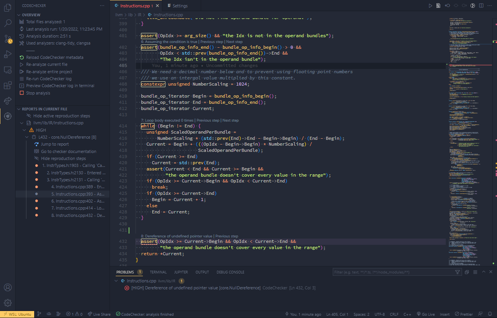
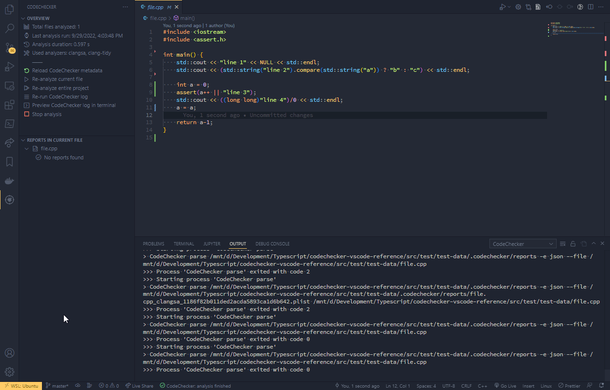
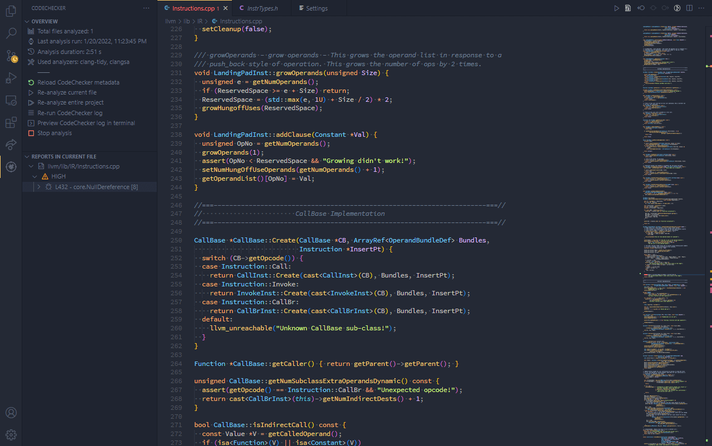
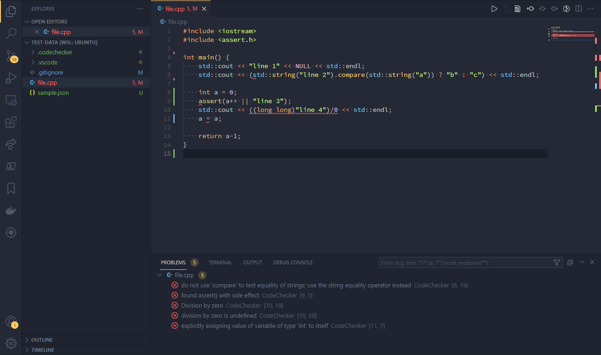

# CodeChecker VSCode Plugin

This is a C/C++ code analysis plugin for VSCode that shows bug reports detected by the [Clang Static Analyzer] and [Clang Tidy] analyzers, using [CodeChecker] as a backend.

[Clang Static Analyzer]: http://clang-analyzer.llvm.org/
[Clang Tidy]: http://clang.llvm.org/extra/clang-tidy/
[CodeChecker]: https://github.com/Ericsson/codechecker

## Quick Start

1. [Install CodeChecker] version 6.18.2 or later, and optionally add it to the `PATH` environment variable.
2. Install the CodeChecker extension from the [Visual Studio Marketplace], from [Open VSX], or download manually from [Downloads].
3. Check the path to CodeChecker, and set your preferred command-line arguments - see [Configuring CodeChecker] for more information.
4. Open your project, and run an analysis, or browse through the found reports!

[Install CodeChecker]: https://github.com/Ericsson/CodeChecker#install-guide
[Visual Studio Marketplace]: https://marketplace.visualstudio.com/items?itemName=codechecker.vscode-codechecker
[Open VSX]: https://open-vsx.org/extension/codechecker/codechecker
[Downloads]: https://github.com/Ericsson/CodecheckerVSCodePlugin/releases
[Configuring CodeChecker]: #configuring-codechecker

## Features

- Browse through the found reports, and show the reproduction steps directly in the code
- Navigate between the reproduction steps (`F9`/`Shift-F9` by default)

- Run a CodeChecker analysis from the editor, and see the results automatically
- Re-analyze the current file when saved (can be disabled in Settings)

- Commands and build tasks for running CodeChecker as part of a build system

## Configuring CodeChecker

The extension uses Codechecker version 6.18.2 or later. If your installation path is different, or CodeChecker is not in the the `PATH` environment variable, the path to it can be set manually under `Preferences > Settings > Extensions > CodeChecker > Executable path`.

The extension can run a CodeChecker analysis on your project, either when saving a file, or when using one of the `CodeChecker: Analyze` commands. You can stop the analysis by clicking the *Cancel* button on CodeChecker's notification - partial results are saved automatically.

The analysis is fully configurable, and the resulting CodeChecker command line can be previewed with the `CodeChecker: Show full command line` command (for supported arguments, run `CodeChecker analyze --help`). Settings for the current workspace can be set on the *Workspace* tab in the Settings. Automatic analysis on saving can be configured as well.

Detailed information about the configuration options can be found under [Settings].

[Settings]: #settings

## Commands and tasks

The extension provides the following commands:

| Command | Description |
| --- | --- |
| `CodeChecker: Analyze current file` | Analyzes the currently opened source file using CodeChecker. Can also be called by clicking on the `Re-analyze current file` button in CodeChecker's side panel.   Useful when the `Run On Save` is turned off in the plugin's settings. |
| `CodeChecker: Analyze selected files...` | Analyzes the files selected by the user, using CodeChecker. Accepts multiple files as input. |
| `CodeChecker: Analyze entire project` | Analyzes the entire project using CodeChecker. Can also be called by clicking on the `Re-analyze entire project` button in CodeChecker's side panel.  *Warning:* A full analysis can take minutes, or even hours on larger projects. |
| `CodeChecker: Stop running CodeChecker instance` | Stops the currently running analysis. Partial results are saved and updated. |
| `CodeChecker: Run CodeChecker log` | Updates the compilation database, by building the current project. A variant with a custom user-specified build command is also available. |
| `CodeChecker: Preview CodeChecker log in terminal` | The current CodeChecker log command is pasted into a new terminal window, where it can be edited before running it. |
| `CodeChecker: Show database setup dialog` | Shows the dialog to select the path to an existing compilation database, or to create a new one. |
| `CodeChecker: Next reproduction step`,   `CodeChecker: Previous reproduction step` | Moves between a displayed reproduction path's steps. You can also navigate directly to a report's step via CodeChecker's side panel.   Default keybinds: `Ctrl-F7`, `Ctrl-Shift-F7` respectively. |
| `CodeChecker: Show full CodeChecker analyze command line` | Shows the full CodeChecker command line used to analyze files.   Useful if you want to review the analyzer's options before running, or if you want to run the analysis manually. |
| `CodeChecker: Show Output` | Focuses CodeChecker's output in the editor. The plugin's logs, as well as the output of previous CodeChecker runs are displayed here. |
| `CodeChecker: Reload metadata` | Reloads CodeChecker's `metadata.json` file. Can also be called by clicking on the `Reload CodeChecker metadata` button on the CodeChecker's side panel. |

The analysis commands are also available in task form:
| **Task** | **Equivalent command** |
| --- | --- |
| `{ type: "CodeChecker", taskType: "currentFile" }` | `CodeChecker: Analyze current file` |
| `{ type: "CodeChecker", taskType: "selectedFiles", selectedFiles: [] }` | `CodeChecker: Analyze selected files...`   Selected files are listed in the `selectedFiles` array, using full paths. |
| `{ type: "CodeChecker", taskType: "project" }` | `CodeChecker: Analyze entire project` |
| `{ type: "CodeChecker log" }` | `CodeChecker: Run CodeChecker log` |
| `{ type: "CodeChecker log", customBuildCommand: "..." }` | `CodeChecker: Run CodeChecker log with custom build command` |

## Settings

Since CodeChecker-related paths vary greatly between systems, the following settings are provided, accessible through the Settings menu:

| Name | Description |
| --- | --- |
| CodeChecker > Backend > Output folder   (default: `${workspaceFolder}/.codechecker`) | The output folder where the CodeChecker analysis files are stored. |
| CodeChecker > Backend > Compilation database path   (default: *(empty)*) | Path to a custom compilation database, in case of a custom build system. The database setup dialog sets the path for the current workspace only. Leave blank to use the database in CodeChecker's output folder, or to use CodeChecker's autodetection for multi-root workspaces. |
| CodeChecker > Editor > Custom bug severities   (default: `null`) | Control how a bug is displayed in the editor, depending on what its severity is. Bugs can be displayed as 'Error', 'Warning', 'Information' or 'Hint'. By default, everything except 'STYLE' severity is displayed as an error. Configured as an array, such as `{ "UNSPECIFIED": "Warning", "LOW": "Warning" }` |
| CodeChecker > Editor > Show database dialog   (default: `on`) | Controls the dialog when opening a workspace without a compilation database. |
| CodeChecker > Editor > Enable CodeLens   (default: `on`) | Enable CodeLens for displaying the reproduction path in the editor. |
| CodeChecker > Executor > Enable notifications   (default: `on`) | Enable CodeChecker-related toast notifications. |
| CodeChecker > Executor > Executable path   (default: `CodeChecker`) | Path to the CodeChecker executable. Can be an executable in the `PATH` environment variable, or an absolute path to one. |
| CodeChecker > Executor > Thread count   (default: *(empty)*) | CodeChecker's thread count - leave empty to use all threads. |
| CodeChecker > Executor > Arguments   (default: *(empty)*) | Additional arguments to `CodeChecker analyze`. For example, if you want to use a config file for CodeChecker pass '--config <config.json>'. For supported arguments, run `CodeChecker analyze --help`.   *Note:* The resulting command-line can be previewed with the command `CodeChecker: Show full CodeChecker analyze command line`. |
| CodeChecker > Executor > Log build command   (default: `make`) | The default build command used when running `CodeChecker log` via commands or tasks. |
| CodeChecker > Executor > Log Arguments   (default: *(empty)*) | Additional arguments to `CodeChecker log`.   *Note:* The resulting command-line can be previewed with the command `CodeChecker: Preview CodeChecker log in terminal`. |
| CodeChecker > Executor > Run on save   (default: `on`) | Controls auto-run of CodeChecker on saving a file. |

## Development
_Note_: If you have already installed this extension from Marketplace, uninstall it first to prevent conflicts with your own build.

This extension uses Node.js (v12+) and Yarn (v2+).
Recommended VS Code extensions are [ESLint] and [TypeScript+Webpack Problem Matcher]

To build and run the extension, do the following:

* `yarn install --immutable`, to install dependencies
* Open in Visual Studio Code (`code .`)
* Press F5 to start debugging
  
To run tests, select Extension Tests as the active debug configuration, or run `yarn run test`.

[ESLint]: https://marketplace.visualstudio.com/items?itemName=dbaeumer.vscode-eslint
[TypeScript+Webpack Problem Matcher]: https://marketplace.visualstudio.com/items?itemName=amodio.tsl-problem-matcher

## License

The extension is released under the [Apache 2.0 license], the same license as [CodeChecker].

[Apache 2.0 license]: https://github.com/Ericsson/CodecheckerVSCodePlugin/blob/main/LICENSE
