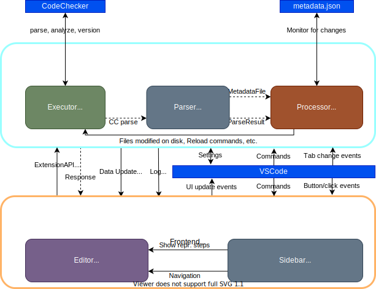

Architecture overview
=====================

Overview
--------

* Each module is handled separately, but along the same lines
* Frontend-backend separation
* Singleton instances, which are returned for testing
  * An outer static wrapper, which creates singleton instances
  * These instances have more readable syntax thanks to `this`
* Registers commands, callbacks, handler instances through the VSCode API

Frontend
--------

Presents the extension's data inside VSCode.

* Editor
  * Anything concerning VSCode's text editor, although it's a tiny bit big now
  * Main parts are diagnostics (which handles the underlines) and CodeLens (which handles the repr. step descriptions)
  * Executor, showing the state of CodeChecker on the statusbar
  * Initializer, for initially running CodeChecker log
  * Logger, for all output logs, even from the backend
  * Navigation, handling keyboard navigation and any kind of movement
* Sidebar
  * Is the main way to interact with the extension
  * Overview: flat list, displays basic stats and provides quick buttons for analyzing etc.
  * Reports: nested list, displays found bugs and reproduction steps
  * There's 2 things we cannot do in the editor:
    * Show/hide reproduction steps, and navigation to each repr. step
    * Those require the sidebar tab to be used

Backend
-------

Receives commands and calls from VSCode, sends events to the frontend.

* Parser and types
  * Parsing was an important step when .plist was in place, now not so much
  * Only purpose now is parsing the metadata.json
  * Types are 1:1 with CodeChecker's outputs
* Processor
  * Makes parsed results available to the frontend
  * Also has events when files are changed, etc.
  * Monitors metadata.json and workspace changes, reloads when updated
* Executor
  * Any kind of CodeChecker running goes through this
  * Can be called via commands, build commands, or directly
  * `process.ts` handles the actual instance scheduling, while `bridge.ts` prepares the command lines, comp.db. path, etc.

Main data processing workflow:

  * Processor detects a file update event, tab change event, or a re-analyze build task is called
  * Executor bridge adds a process, and the manager schedules and runs it
    * All logs are forwarded to the frontend
  * Result is either an OK, or gets passed over to the parser (from the parse command)
  * Parser transforms it into the internal types, which are then loaded into the processor
  * Processor fires events that data is updated, which is then read by the frontend
